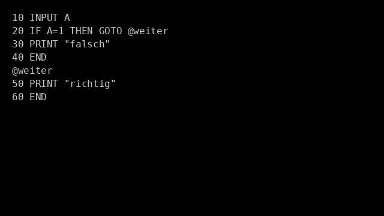

# gwbasic.vim

Ein Vim-Plugin zur komfortablen Arbeit mit **GW-BASIC**-Quelltexten – inklusive Syntaxhighlighting, automatischer Zeilennummerierung, Label-Unterstützung und Direktstart mit `pcbasic`.



---

## ✨ Funktionen

- ✅ Syntax-Highlighting für **alle** GW-BASIC-Befehle, Funktionen und Systemvariablen
- ✅ Automatische Zeilennummerierung beim Drücken von `<Enter>`
- ✅ Leere Zwischenzeilen mit `<Ctrl-Enter>` oder `<Ctrl-j>` (ohne Nummer)
- ✅ Unterstützung von Labels (z. B. `@weiter`) für GOTO/GOSUB
- ✅ Automatische Umwandlung aller Befehle in GROSSBUCHSTABEN bei Ausführung
- ✅ `:Run` – aktuelle Datei speichern, Labels ersetzen, und mit `pcbasic` starten
- ✅ `:Renumber` – BASIC-Zeilen neu nummerieren, Labels ersetzen
- ✅ `:ResolveLabels` – erzeugt Datei mit aufgelösten Labels (`*_expanded.bas`)
- ✅ `<Ctrl-r>` – Tastenkürzel für `:Run`

---

## 🔧 Installation (mit [vim-plug](https://github.com/junegunn/vim-plug))

Füge dies in deine `~/.vimrc` ein:

```vim
call plug#begin('~/.vim/plugged')

Plug 'ssulser/gwbasic.vim'

call plug#end()
```

Dann in Vim:

```vim
:PlugInstall
```

---

## 💻 Beispiel: `demo.bas`

```basic
10 INPUT A
20 IF A = 1 THEN GOTO @weiter
30 PRINT "falsch"
40 END
@weiter
50 PRINT "richtig"
60 END
```

Nach `:Run` wird automatisch eine Kopie erstellt:

```basic
10 INPUT A
20 IF A = 1 THEN GOTO 50
30 PRINT "falsch"
40 END
50 PRINT "richtig"
60 END
```

---

## 🔑 Kommandos

| Befehl            | Funktion                                                                 |
|-------------------|--------------------------------------------------------------------------|
| `<Enter>`         | neue BASIC-Zeile mit automatisch fortlaufender Nummer                   |
| `<Ctrl-Enter>`    | neue Zeile **ohne Nummer** (z. B. für mehrzeilige Strukturen)           |
| `<Ctrl-r>`        | ruft `:Run` auf – Datei speichern & mit `pcbasic` starten                |
| `:Run`            | speichert Datei, ersetzt Labels in Kopie und startet `pcbasic`          |
| `:Renumber [n]`   | ersetzt alle Zeilennummern mit Schrittweite `n` (Standard: 10)           |
| `:ResolveLabels`  | ersetzt Labels in Datei → `*_expanded.bas` im selben Verzeichnis        |

---

## ⚠️ Voraussetzung

- [`pcbasic`](https://github.com/robhagemans/pcbasic), z. B. per:

```sh
pip install pcbasic
```

- Vim ≥ 8 oder Neovim
- Empfohlen: monospaced Schriftart (z. B. DejaVu Sans Mono)

---

## 📃 Lizenz

MIT-Lizenz © 2025 [ssulser](https://github.com/ssulser)
