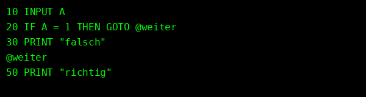

# gwbasic.vim

Ein Vim-Plugin zur komfortablen Arbeit mit **GW-BASIC**-Dateien.



## ✨ Features

- Syntax-Highlighting für alle GW-BASIC-Statements und Funktionen
- Automatische Zeilennummerierung bei `<Enter>`
- Einfügen leerer Zeilen mit `<Ctrl-Enter>`
- Unterstützung von **Labels** (z. B. `@weiter`) für `GOTO`, `GOSUB` etc.
- Befehle wie `:Renumber`, `:ResolveLabels`, `:Run`
- Automatische Großschreibung aller BASIC-Befehle beim Ausführen
- Direkte Ausführung mit [`pcbasic`](https://github.com/robhagemans/pcbasic)

## 🔧 Installation (mit [vim-plug](https://github.com/junegunn/vim-plug))

```vim
Plug 'ssulser/gwbasic.vim'
```

Dann in Vim:

```vim
:PlugInstall
```

## 🚀 Befehle

| Befehl            | Funktion                                           |
|-------------------|----------------------------------------------------|
| `<Enter>`         | neue Zeile mit nächster BASIC-Zeilennummer         |
| `<Ctrl-Enter>`    | neue Zeile **ohne** Nummer (z. B. für Strukturblöcke) |
| `<Ctrl-r>`        | führt Datei mit `:Run` aus                         |
| `:Renumber`       | nummeriert alle Zeilen neu, Labels werden ersetzt |
| `:ResolveLabels`  | ersetzt Labels in Kopie (`_expanded.bas`)         |
| `:Run`            | speichert Datei, ersetzt Labels, startet `pcbasic` |

## 🧪 Beispiel (demo.bas)

```basic
10 INPUT A
20 IF A = 1 THEN GOTO @weiter
30 PRINT "falsch"
40 END
@weiter
50 PRINT "richtig"
60 END
```

Nach `:Run` wird daraus automatisch:

```basic
10 INPUT A
20 IF A = 1 THEN GOTO 50
30 PRINT "falsch"
40 END
50 PRINT "richtig"
60 END
```

## 📦 Voraussetzungen

- Vim ≥ 8 oder Neovim
- [`pcbasic`](https://github.com/robhagemans/pcbasic) im `$PATH` (z. B. via `pip install pcbasic`)

## 📃 Lizenz

MIT-Lizenz © 2025 ssulser
